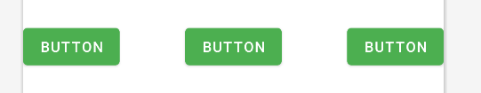
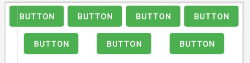
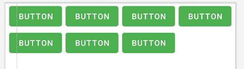

# Android

## Components

Activity: entry point for user interaction e.g. track what is on the screen
- Activity with transparent background: apply a theme which its `android:windowIsTranslucent` is set to true and its `android:windowBackground` is set to transparent

Service: run in the background e.g. music playback

Broadcast receivers: gateway for system event

Content providers: provide an API to share data with other apps, sharing can be done by URI

Intent: an asynchronous message which activates Activities, Services, and Broadcast receivers

- Explicit Intent: specify which activity will handle this action

- Implicit Intent: specify what action to be handled by activities

- Sticky Intent: still exists after broadcasting, allowing other components to collect data

Module: a collection of source files and build settings to divide the project for discrete functionality

`build.gradle`: build configuration that applies to all modules

`AndroidManifest.xml`: declare existing components, API level, required permissions, required hardware features

- `manifestPlaceholders`: creates "variables" to be used in `AndroidManifest.xml`

- `<intent-filter>`: specifies the types of intents components can respond to

- launchMode:

    - standard: default, will create a new activity regardless if it is in the task stack

    - singleTop: if the target activity is already on top, use it, otherwise, create a new one

    - singleTask: if the target activity is already in the task stack, use it and pop activities above it, otherwise create a new one

    - singleInstance: create a new activity in a new task

Context: context of the state of the app, get info about activity and application, access resources, preferences, room, both Activity, and Application 
Context

`applicationContext`: for reference by singleton class e.g. room, datastore

`activityContext`: for reference by UI operations e.g. toast, dialog

Application: contains all other components such as activities and services.

Fragment: has its layout and its behavior with its lifecycle callbacks, can add or remove fragments in the activity, can combine multiple fragments in an activity, can be reused in multiple activities, the lifecycle is closely related to the lifecycle of its host activity.  Fragment was introduced with Android 3.0, which also introduced tablet support.

- Fragment replace: removes existing fragment and adds new fragment

- Fragment add: retains existing fragment and adds new fragment

- Retained Fragment: By default, Fragments are destroyed and recreated along with their parent Activity’s when a configuration change occurs. Calling setRetainInstance(true) bypasses this cycle, retaining the current instance of the fragment when the activity is recreated.

- When to use fragment over activity: when UI components are reused across activities when showing views side by side

- `addToBackStack()`: replace transaction is saved to back stack so the user can bring back the previous fragment with the back button

- When the user hits the system Back button, going from B back to A, the reverse happens: the entering destination A will have the popEnterAnim applied to it and the exiting destination B will have the popExitAnim applied to it.

- Using only the default Fragment constructor is recommended because Android calls a no-argument constructor and it is not aware of others

Mipmap folder: for the launcher icon

`jni/`: native code using the Java Native Interface (JNI)

`gen/`: contains the Java files generated by Android Studio

`assets/`: contains the file that should be compiled into an .apk file as-is. Can navigate this directory in the same way as a typical file system using URIs and read files as a stream of bytes using the AssetManager. A good location for textures and game data.

AIDL: handles how the client and the service interact

ViewBinding: eliminates the need of `findViewById()` by generating binding class for each XML layout

DataBinding: in addition to features in ViewBinding, it allows binding variables, invoking methods, in XML while having a longer compile time

How to increase the Notification delivery rate in android?: 

- Use a high-priority notification channel
- Use appropriate notification category
- Avoid sending too many notifications
- Be mindful of battery consumption of the app

`ViewModel` lifecycle in an Android app: 
1. The view requests a `ViewModel` from the `ViewModelProvider`, if it exists skip step 2, if not, create a new one and return it after its initialization
2. A new `ViewModel` is created, it is initialized with any data that is needed to set up its state. This data can come from a variety of sources, such as a database or a remote API.
3. If the view gets destroyed or recreated due to memory constraint or configuration change, the `ViewModel` is retained, it is requested again like in step 1
4. If the view is destroyed because the user closes the app or leave the page, the `ViewModel` gets destroyed too

`WorkManager` provides a way to schedule and execute background tasks, its use-cases are:
1. Sync data
2. Push notifications
3. Upload/Download files
4. Do background cleanup
5. Generate reports
6. Preload data

In `LiveData`, `setValue()` must be called from main thread, while `postValue()` can be used to update from background thread, however if it is invoked multiple times before the main thread executes, only the latest posted value may be observed

Android Support Library: a collection of libraries that provide backward-compatible versions of Android framework APIs as well as additional features and utilities that are not included in the framework. It was introduced to help developers build apps that work across different versions of Android and provide a consistent user experience on all devices.

Multitouch can be handled with `MotionEvent`, `pointerCount` is used to get the number of touch points currently on the screen, and a loop is used to retrieve the position of each touch point using the getX() and getY() methods.

Bundle class is commonly used for passing data between activities, fragments, and other components. While it may be possible to use a simple Map data structure for passing data, there are several reasons why Bundle is a better choice:
1. Type safety: Bundle provides type safety for the data that is being passed. This means that the data is checked to ensure that it conforms to a specific data type, which can help prevent errors and improve code reliability.
2. Serialization: Bundle provides built-in serialization support for many common data types, such as strings, integers, and arrays. This makes it easy to pass data between components, even if the data needs to be persisted across app restarts or device rotations.
3. Compatibility: Bundle is a standard Android class that is widely used across the Android platform. This means that other components, such as system services and third-party libraries, are designed to work with Bundle, which can improve compatibility and reduce the risk of errors.
4. Performance: Bundle is optimized for performance in the Android platform, and provides efficient memory management and serialization algorithms that can improve app performance.

`LiveData`: a class in the Android Jetpack library that is a lifecycle-aware observable data holder class, which means that it allows you to observe changes to a data source and automatically update the UI when the data changes.

## Architecture

Model: models, local/remove data source and repository. Represents the data and the business logic of the Android Application.

View: mostly Activity, Fragment and XML. Sends the user action to the middleman

MVC:

The view has direct access to the model, the controller handles user interaction and updates the model

- +streamlines code

- -poor scalability

- -difficult unit-testing

- view is not aware of controller, model is exposed to view

- controller: user directly interacts with the controller

MVP:

Presenter: the view calls the view-model via the contract interface, the view-model passes update event to the view via the contract interface

- +easy unit-testing

- +view/presenter reusable

- +observer not required

- -additional view interface

- -coupled view/presenter

- =view has reference to presenter

MVVM:

ViewModel: the view calls the view-model directly, the view-model passes update event to the view via observables e.g. `LiveData` or `StateFlow`

- +no coupled view/viewmodel

- +easy unit-testing

- -observe for each UI component

- -obsessive code

- -requires observer

- =view has reference to VM but VM is not aware of view so VM can be used in multiple views

Why use clean architecture?: modularize the different functions of an application so that each component is separate and can be updated and tested independently

- Domain: contains repeated or complex logic for a view model

- Data: contains data handling logic

- UI: contains UI handling logic

Event-driven architecture:

- +loosely coupled, subscriber does not need to know who sends the event

- +easy to pass simple data for update

- -difficult debugging, harder to trace what subscriber handles the event

## API

OkHttp vs Retrofit: Have to build requests yourself in OkHttp, Retrofit is slower on update because it is based on OkHttp

Gson vs Moshi: Moshi is written in Kotlin, is lighter, uses Kotlin code-gen instead of reflection

Why Moshi uses Kotlin codegen: it allows generating code at compile time instead of at runtime with reflection

OkHttp Interceptor can cache network data so the app is still usable offline, it can also intercept network requests and print them

Multipart request: a type of HTTP request that allows you to send multiple types of data in a single request. This is useful when you need to upload files or send a form with both text and binary data.

gRPC: a framework for communication with Protocol Buffer

- Channel: creates a connection to the server, required by Stub creation

- Stub: calls methods defined in the proto files

gRPC is a new take on an old approach known as RPC (Remote Procedure Call), a form of inter-process communication essentially used for client-server interactions. The client can request to execute a procedure on the server as if it were a normal local procedure call thanks to the stub generated for both client and server.

REST API: there are clients and a server, clients send HTTP request in methods GET/POST/PUT/DELETE to the server, and the server responds in a standard format, usually JSON

JSON: widely used in web development and data exchange between systems. JSON is human-readable and easy to parse and generate using built-in libraries in most programming languages. JSON does not require a schema. However, JSON is less efficient in terms of performance and memory usage than binary formats like FlatBuffers, and requires parsing and validation at runtime.

Protocol Buffers: aka protobuf. It uses a schema to define the data structure, which is written in a language-independent format called the Protocol Buffer Language. The schema is used to generate code in various programming languages to read and write the data in a strongly-typed, type-safe manner. Protocol Buffers supports many data types, including integers, floats, doubles, strings, booleans, and enums.

FlatBuffers: uses a schema to define the data structure and generates code to read and write the data in a strongly-typed, type-safe manner. FlatBuffers does not require parsing or validation at runtime, which makes it faster and more memory efficient than text-based formats like JSON.

## View

`View`: superclass for all UI components

`ViewGroup`: a parent to hold children e.g. `LinearLayout` with `TextView` and Button

`Canvas`: What to draw

`Paint`: How to draw

How `RecyclerView` works?: The Adapter binds views and then passes them to the Layout Manager, the RecyclerView only allocates fixed numbers of views that fit the screen.  When a view is out of sight it becomes a scrap view and is temporary detached to the recycle pool, when the next items need to be displayed, it is reused by passing new data into the view and then is returned to the viewHolder as "dirty view"

Why use `RecyclerView` over `ListView`?: `ListView` creates as many views as data count in a dataset, with no built-support for animation, only vertical scroll

`RecyclerView` consists of:

- `Adapter`: binding for a dataset, aware of where each item is located in the dataset

- `LayoutManager`: positions items within the RecyclerView

- `ItemAnimator`: defaults to DefaultItemAnimator

- `ViewHolder`: draws for individual items

Mipmaps are used for icons, every resolution of them is used in case the launcher needs to display larger icon

Drawables are used for everything else, only 1 resolution will be used

`TabLayoutMediator`: links TabLayout and ViewPager2, synchronizing positions between them

`dp`: abstract pixel unit scaled based on the dpi of the screen

`sp`: similar to dp except text size preference affects it too

`ConstraintLayout` helpers:

- Chains: a group of views that are linked to each other with bi-directional position constraints, can be used to distribute space between views evenly, eliminating the necessity of `LinearLayout`, they have different modes:

    - `spread`: default mode, it will position the views in the chain at even intervals within the available space
    
    
    
    - `spread_inside`: snaps the outermost views in the chain to the outer edges, and then positions the remaining views in the chain at equal intervals within the available space

    

    `layout_constraintHorizontal_weight` / `layout_constraintVertical_weight` can be used to adjust a view's "weight" in its width/height if its `layout_width`/`layout_height` is set to 0 and is in `spread` or `spread_inside` chains

    - `packed`: packs the views together, and then centres the group within the available space, the positioning of the packed views can be further controlled by altering the `bias` value
    
    
    
- `Barrier`: allows you to specify a constraint based on the height/weight of target views, which makes a `Barrier` flexible

- `Guldeline`: specifies a fixed distance in dp or in percent based on the layout's size

- `Flow`: a virtual layout which is able to wrap other views without adding a level to the layout hierarchy

    - wrap modes:

      - `none`: creates a horizontal/vertical chain out of referenced views

      

      - `chain`: also creates a chain out of referenced views, but will wrap to the next row/column if items don't fit into one, if there is leftover space in the next row/column, it will distribute the distance between items evenly

      

      - `aligned`: like `chain`, except it aligns items from left to right

      

- `Layer`: a virtual layout which animates multiple views at once as a single unit

- `Group`: a virtual layout which controls visibility of multiple views

## Dependency Injection

Why use dependency injection?: 
- easier refactoring
- easier testing
- easier to reuse code
- easier collab
- separate of concern

How DI works?: the service implements the interface, the client depends on the interface, the injector creates the service and injects it into the client

Why use Dagger?:

- easier dependency management

- allowing to pass mocked dependencies from the outside for easier unit testing

- easier scope management

What Are Components In Dagger?: They are a way of telling Dagger 2 what dependencies should be bundled together and made available to a given instance so they can be used.

What Are Modules In Dagger?: installed to that component to allow binding to be accessed

`activityViewModels()`: injects viewmodel shared in the activity

## Performance

Why does the Android App lag?: when GC occurs, your UI stops updating until GC is done. When there is too much done on the main thread

What is Garbage Collection?: reclaiming runtime memory by destroying unreferenced objects

How does Garbage Collection work?: mark roots(objects referenced by static fields, application class, live thread)->mark referenced objects->mark reachable objects->GC unreachable objects

`System.gc()` is used to perform manual garbage collection

Why use Jetpack?: a set of libraries that provide backward compatibility and best practices

R8: trims class/function name, remove unused methods, and merge code only used once

Low Memory Killer priority: empty(unused) processes->background processes(CREATED activity)->service processes->visible processes(STARTED activity)->foreground processes(RESUMED activity)

What to be cautious about while using Bitmap?: Downscale the bitmap or load the lower resolution version of the bitmap to fit into the view, so it does not take up unnecessary memory for no benefit

Memory Leak: unused objects GC is unable to clear

Bitmap Pool enables the reuse of bitmaps, effectively lowering frequency of GC

Image-loading libraries utilize this to load bitmaps more effectively, they also downscale images just enough to fit into a view to avoid excessive memory usage

## Lifecycle

Activity:

- `onCreate()`: init activity, only called once through the whole lifecycle

- `onStart()`: when the user can see the screen

- `onResume()`: when the user can interact with the screen

- `onPause()`: when part of the app is visible but in the background

- `onStop()`: when the app is not visible to the user

- `onDestroy()`: activity is no longer used, cleaning up activity

if in `onStart()`, `finish()` is called, `onPause()` and `onStop()` won't be called and will just call `onDestroy()`

In which situations Activity can be in the `onPause()` state and never calls `onStop()`?: 

- Picture-in-Picture mode: the user cannot interact with the activity but it is still visible

- Split screen: when the user has A activity call `onResume()` by interacting with it, B activity has `onPause()` called, but B is still visible

- Another activity started with transparent background: GooglePay purchase screen is actually an Activity with transparent background rather than a Dialog, the previous activity is still visible

`setContentView()` is called in `onCreate()` because `onCreate()` is only called once

`onSavedInstanceState()`: store data before pausing the activity

`onRestoreInstanceState()`: recover the saved state of an activity when the activity is recreated after the destruction

Service:

- `onStartCommand()`: runs when other components request the service to start by `startService()`

- `onBind()`: when other Android components try to connect with the service

- `onCreate()`: setup process when the service is created

- `onDestroy()`: service is no longer used, clean up service

Fragment:

Lifecycle of `viewLifeCycleOwner`: `onViewCreated()`~`onDestroyView()`

Lifecycle of `LifecycleOwner` of the Fragment: `onCreate()`~`onDestroy()`

- `onAttach()`: the fragment is added to a `FragmentManager`

- `onCreate()`: initialize a fragment, when the fragment is added to a `FragmentManager`

- `onCreateView()`: instantiate UI

- `onViewCreated()`: gives subclasses a chance to initialize themselves once they know their view hierarchy has been completely created

- `onViewStateRestored()`: view states such as checkbox check are restored

- `onStart()`: called when the fragment is visible, tied with `onStart()` of the activity

- `onResume()`: when the fragment is interactable, tied with `onResume()` of the activity

- `onPause()`: when the fragment is no longer interactable, tied with `onPause()` of the activity

- `onStop()`: when the fragment is no longer visible, tied with `onStop()` of the activity

- `onSaveInstanceState()`: saves states of the fragment, so it can be restored to previous state if the process was terminated. Before API 28, this is invoked before `onStop()`

- `onDestroyView()`: when the view `onCreateView()` created has been detached

- `onDestroy()`: when the fragment is no longer used, when the fragment is removed from a `FragmentManager`

- `onDetach()`: the fragment is removed from a `FragmentManager`

View:

- `onAttachedToWindow()`: when the view is attached to a window

- `onMeasure()`: determine the size of the view

- `onLayout()`: called to assign size for its children if any

- `onDraw()`: called when the view needs to render content

`invalidate()`: rerun from `draw()` process

`requestLayout()`: rerun from `measure()` process

## Debug

adb: a CLI tool used to communicate with a device, can be used to debug, install apps, capture screenshots, record screen and transfer files

App Inspection: can be used to inspect the in-app database and network usage

Profiler: enables tracking CPU, memory and energy usage with events shown in a timeline

Thread dump can be used to identify deadlocks

Heap dump can be used to identify memory issues

StrictMode: a developer tool in Android that helps identify potential performance and threading issues in an application, by detecting violations of certain rules that are known to cause performance problems, such as disk access on the main thread, network access on the main thread, and long-running operations on the UI thread.

How to debug database in an app: Database Inspector can be used to do CRUD and run custom quaries to the database

# Development

Gradle: a build automation tool that is used to build, test, and package Android apps. It provides a flexible and powerful build system that can be used to automate complex build tasks and manage dependencies. It provides:
1. Dependency management: Gradle makes it easy to manage dependencies for a project, including downloading and caching dependencies, resolving conflicts, and specifying custom repositories.
2. Build configuration: Gradle allows developers to configure the build process using a Groovy-based DSL, providing a high degree of flexibility and customization.
3. Task-based build system: Gradle is a task-based build system, which means that it defines a set of tasks that can be run independently or as part of a larger build process. This allows developers to build and test their app incrementally, without having to rebuild the entire app every time.
4. Incremental builds: Gradle supports incremental builds, which means that it only rebuilds the parts of the app that have changed since the last build. This can significantly reduce build times and improve developer productivity.
5. Plugin architecture: Gradle has a plugin architecture that allows developers to extend the build system with custom plugins. This makes it easy to integrate with other tools and technologies, such as testing frameworks, code analysis tools, and continuous integration servers.

CI: build->test->merge CD: automatically deployment

Scrum: iterative development, daily meeting to report and adjust the process

ATDD: tests are written from the user's perspective "is this the result I expected?"

UML Diagram: is used to visualize the flow of a program [Link](https://www.smartdraw.com/uml-diagram/)

Lint: a static code analysis tool that is included with the Android SDK. It is used to analyze the source code of an Android application and identify potential issues, such as performance problems, coding style violations, and security vulnerabilities.

Software Development Lifecycle:

1. Analysis: Gather, clarify and analyze requirements

2. Plan: Architecture decisions, UI design and resource allocation

3. Code: Implement decisions and design

4. Test: Test if the code meets requirements

5. Deploy: Put the project into production

6. Maintenance: New features, bug fixes, monitoring

Firebase: a mobile app development platform that provides a range of tools and services for building Android apps. Such as cloud storage, real-time databases, and authentication, as well as tools for testing, monitoring, and optimizing app performance.
- Firebase Realtime Database: a cloud-hosted NoSQL database that allows developers to store and sync data in real-time across multiple clients

Google/Firebase Analytics can be used to provide matrics on the number of active users, the number of installs, and the number of uninstalls

Staged rollout to control percentage of users to release to, to collect possible issues before fully release

How to change parameters in an app without updating?:
1. download configurations from remote server
2. Firebase Remote Config

Obfuscation: intentionally making code more difficult to understand, by renaming classes, variables, and methods to meaningless or cryptic names. The goal of obfuscation is to make it harder for someone to reverse engineer the code or extract sensitive information from it.

Minification: reduce the size of code by removing unnecessary characters such as whitespace, comments, and unused code. The goal of minification is to reduce the size of the code, which can make the app load faster and use less storage space.

ProGuard: a code obfuscation tool that is used to shrink, optimize, and obfuscate Java bytecode. When used correctly, ProGuard can help to reduce the size of your app and protect your code from reverse engineering. However, it may remove code that is necessary for an app to run, so monitoring after obfuscation is recommended

Multiple APKs: allows developers to create different APKs for the same application, each optimized for different device configurations

Android App Bundle: If an AAB is uploaded to Google Play, it will provide optimized APK for respective device automatically

DEX: "Dalvik Executable" is a file format used by the Android operating system to execute compiled code. The DEX format is optimized for Android's virtual machine, the Dalvik Virtual Machine (DVM), which is designed to run on resource-limited devices such as smartphones and tablets.

Multidex: a mechanism provided by Android to overcome limitation of 65,536 method references. It allows apps to have multiple DEX files, each containing a subset of the app's method references. When the app is run, the Android runtime loads all the DEX files and combines them into a single Dalvik Virtual Machine (VM) instance.

AAPT2: Android Asset Packaging Tool 2, provided by the Android SDK that is used to package and optimize Android app resources, such as images, layouts, and other assets.

# Programming basics

SOLID:

- S: single purpose per class

- O: open to extension but closed to modification

- L: replacing a superclass with its subclass shouldn't break any functions

- I: depending on the interface with needed functions rather than a concrete class with many functions, do not make functions useless to the client visible to it.

- D: high-level classes shouldn't depend on low-level classes, high-level class depends on an interface to avoid changing along with low-level classes

Interface: cannot have fields, can implement multiple interfaces, functions cannot be final. Used when functions are expected on unrelated classes when no changes are expected when 
ing small bits of functionality, can be inherited from another interface. "What can the object do"

Abstract class: can only inherit 1 abstract class, has constructors. Used when a base class is needed, when additional features are expected, inherence does not break superclass functions "What this object is"

Serialization: a process of translating a data structure or object state into a format that can be stored or transmitted

Serializable: easy to use and is built into Java, as it requires no additional code to be written, but it can be slower and less memory-efficient than Parcelable. Serializable also creates a lot of temporary objects during the serialization process, which can impact performance.

Parcelable: Android-specific interface that allows an object to be flattened into a parcel and reconstructed later. Parcelable is faster and more memory-efficient than Serializable, as it creates fewer temporary objects during the serialization process. However, Parcelable requires more boilerplate code to be written compared to Serializable. Fortunately, with `@Parcelize` annotation in kotlinx, `Parcelable` methods will be generated automatically

Both `Serializable` and `Parcelable` are used to transfer data between screens, usually via `Bundle`

Strong reference: as long as there is a strong reference to an object, it will not be eligible for garbage collection

Weak reference: cleared by the garbage collector as soon as there are no more strong references to the object

Soft reference: cleared by the garbage collector only when the JVM is running low on memory. Soft references are typically used to implement memory-sensitive caches

Phantom reference: enqueued by the garbage collector after the object to which it refers has been finalized, but before the object's memory has been reclaimed. Phantom references are typically used to perform post-mortem cleanup operations on objects, such as removing their associated resources, after they have been finalized.

OOP: a concept about classes and objects which can be done in inheritance, polymorphism, abstraction, and encapsulation

Polymorphism: same method name can behave differently in different classes

Overloading: passing different parameters will give different behaviors

Abstraction: exposes only what the object does e.g. abstract class and interface

Encapsulation: hides away implementation detail e.g. private, protected

Inheritance: inherit behaviors and info of the superclass

It is a bad idea to call an abstract method from a constructor because the implementation of the method is not yet known, leading to unexpected behavior

Anonymous class enables quick implementation and definitation of an interface, or extending a class without naming said class

Instantiation is the process of creating a new object

Initialization is the process of setting the initial values of an object's instance variables

`PriorityQueue` allows elements to be inserted with an associated priority, and provides operations to remove the element with the highest priority, used in sorting, task scheduling, and event processing

Generics: provide a way to write generic classes and methods that can work with different types, while still providing compile-time type safety

## Kotlin/Java

inline function: inlined functions will not be actual functions in bytecode, instead the piece of code is part of the function used inline function, and will not be able to access private members/methods of your enclosing class. You will need to make those members/methods internal and then annotate them with `@PublishedApi`. Will be able to return from the lambda which in turn will return from the calling function.

- `crossinline`: disallow return in lambda

- `noinline`: `noinline` lambdas do not support non-local control flow, i.e you won’t be able to propagate your return to the calling function.

`@JvmStatic`: marks the function as static in java, so you don't have to call that function by `AppUtils.INSTANCE.install()`

`@JvmOverloads`: java does not support default parameters, use this annotation to tell the compiler to create overloads for java

`@JvmField`: tells the compiler not to generate getter/setter for the field

Reflection is the ability to make modifications at runtime by making use of introspection.

`Integer` vs `int`: `Integer` is a wrapper class of int which has utility functions to manipulate `int`, while `int` is a primitive type

You can implement another interface inside an interface

Auto/UnBoxing: auto/unwrapping primitive types to wrapper type

`equals()` vs `==`: `==` compares reference in Java, `equals()` compares value based on how the class implements

`==` vs `===` in Kotlin: `==` checks `equals()`, `===` checks reference

`Pair<T1, T2>`: pair 2 data together so no need to declare a new data class for storing them

`Triple<T1,T2,T3>`: pair 3 data

`Array` in Kotlin: has fixed size, has better performance and is mutable so values can be changed

`List` in Kotlin: immutable by default unless created as `MutableList`, has to add/remove method to manipulate list size, has better scalability

label in Kotlin: used to declare which loop to break/continue in a for loop

Overloading: methods have the same name but different signatures e.g. parameters

`data class`: some utility functions are created by Kotlin if it is marked data class:

`sealed class`: forces to add remaining branches while the referenced sealed class object is in when()

- `toString()`

- `equals()`/`hashCode()`

- `copy()`

- `componentN()`: destructure object to a variable

`let()`: inputs object as a receiver, object as a parameter in lambda, returns the lambda result

`run()`: inputs object as a receiver, object as a receiver in lambda, returns the lambda result

`also()`: inputs object as a receiver, object as a parameter in lambda, returns the object

`apply()`: inputs object as a receiver, object as a receiver in lambda, returns the object

`with()`: inputs object as a parameter, object as a receiver in lambda returns the lambda result

Static block in a class is run before invoking a static method, or before instantiating the first object of the class, it is run only once

Static methods cannot be overridden

`throw` manually throws an exception

`throws` in Java or `@Throws` in Kotlin indicates that a function may throw an exception

`try-catch` is used to gracefully recover from an exception

`finally` is invoked whether an exception is handled or not in `try-catch`

`finalize()` is invoked to perform cleaning up before being garbage collected, deprecated in Java 9 as it can lead to unexpected behavior

`String.intern()` returns a canonical representation of a String object from the string pool

Advantages of making an object final:
- ensuring it is never changed after initialization
- making it thread safe
- allows JVM to optimize it

`transient` excludes said field from being serialized, such as conditental data, cache field or non-serializable field

A checked exception must be declared in a method or constructor's throws clause. When a checked exception is thrown, the calling method must either handle the exception or declare it in its own throws clause. e.g. `IOException`, `SQLException`, `ClassNotFoundException`.

An unchecked exception, also known as a runtime exception does not need to be declared in a method or constructor's throws clause. Unchecked exceptions are usually caused by programming errors, such as null pointer dereferences, division by zero, or out-of-bounds array accesses. Examples of unchecked exceptions in Java include `NullPointerException`, `ArithmeticException`, and `ArrayIndexOutOfBoundsException`.

`volatile` ensure that changes to a shared variable's value will be immediately visible to all threads that access the variable

`synchronized` ensures that only one thread can execute a block of code or access an object's state at a time, preventing race conditions and other synchronization problems

`ThreadPoolExecutor` is for managing and executing tasks in parallel

Java memory model defines the rules and guarantees for how threads interact with shared memory in a Java program. It specifies how threads can access shared data and how changes made by one thread become visible to other threads. It guarantees 2 contracts:
- Visibility: Changes made by one thread to shared memory are guaranteed to be visible to other threads that access the same memory.
- Atomicity: Operations on shared memory are guaranteed to be executed atomically, meaning that they are either completely executed or not executed at all.

Java memory model defines two types of memory:
- Heap is a shared memory region where all objects are allocated. The Heap is managed by the garbage collector and is used to store objects that are created at runtime. All threads in a Java program share the same Heap, and objects on the Heap can be accessed by multiple threads.
- Stack is a memory region where each thread has its own stack frame. A stack frame contains information about method calls, local variables, and other data specific to a particular thread. When a thread calls a method, a new stack frame is created for that method. When the method completes, the stack frame is removed. The Stack is used to store primitive types and object references, and is not shared between threads.

`Iterator`: an interface that is used to traverse through collections of objects, such as `ArrayList`, `LinkedList`, and `HashSet`. The `Iterator` provides a way to iterate over the collection and access its elements one by one without exposing the underlying data structure of the collection.

Kapt: generate annotation for Kotlin

Annotation: allows you to add metadata, or information about code, to your program. Annotations provide a way to associate information with a program element, such as a class, method, variable, or parameter, without affecting its runtime behavior.

Annotation processing: allows compile-time code generation for annotated classes/methods, in order to simpify development

Annotation retention: specifies how long an annotation should be retained, or kept, by the JVM, available retention policies are:
- RetentionPolicy.SOURCE: Annotations with this retention policy are only retained in the source code and are discarded by the compiler during the compilation process. They are not available at runtime.
- RetentionPolicy.CLASS: Annotations with this retention policy are retained in the compiled class file but are not available at runtime. This is the default retention policy if no retention policy is specified.
- RetentionPolicy.RUNTIME: Annotations with this retention policy are retained in the compiled class file and are available at runtime through reflection. This is the only retention policy that allows you to access annotations at runtime.

Target element type: specifies the types of elements that an annotation can be applied to. There are several target element types available:
- ElementType.TYPE: can be applied to classes, interfaces, enums, and annotations.
- ElementType.FIELD: can be applied to fields, including enum constants.
- ElementType.METHOD: can be applied to methods.
- ElementType.PARAMETER: can be applied to parameters of a method or constructor.
- ElementType.CONSTRUCTOR: can be applied to constructors.
- ElementType.LOCAL_VARIABLE: can be applied to local variables.
- ElementType.ANNOTATION_TYPE: can be applied to annotations.
- ElementType.PACKAGE: can be applied to packages.
- ElementType.TYPE_PARAMETER: can be applied to the type parameter of a generic class, interface, method, or constructor.
- ElementType.TYPE_USE: can be applied to any type use, such as casting, instanceof checks, and method references.


Creating an annotation class in Kotlin: 
1. define a new annotation class e.g. `annotation class MyAnnotation(val value: String)`
2. `@Retention` and `@Target` annotations are used to specify the annotation retention policy and target element type, respectively.
```
@Retention(AnnotationRetention.RUNTIME)
@Target(AnnotationTarget.CLASS)
annotation class MyAnnotation(val value: String)
```
3. use the custom annotation
```
@MyAnnotation("Hello, World!")
class MyClass
```
4. retrieve the annotation and its value from `MyClass` at runtime
```
val annotation = MyClass::class.annotations.find { it.annotationClass == MyAnnotation::class }
val value = (annotation as? MyAnnotation)?.value
```
ArrayMap: an Android-specific data structure that implements the Map interface and uses arrays to store key-value pairs. ArrayMap provides similar performance to HashMap for small and medium-sized data sets, but is more memory efficient for larger data sets.

SparseArray an Android-specific data structure that implements the Map interface and uses arrays to store key-value pairs, but is specialized for integer keys. SparseArray is optimized for memory usage and is more memory efficient than HashMap and ArrayMap for data sets with integer keys. SparseArray provides constant-time performance for most operations, but may be slower than HashMap and ArrayMap for data sets with non-integer keys.


### Coroutines

Kotlin Coroutines: enables writing in synchronous way, while the code actually runs asynchronously and concurrently

`CoroutineScope`: the lifecycle of this coroutine

`Job`: its main responsibility is to manage coroutine cancellation.

- `join()`: blocks the execution of the rest of the coroutine code before this job is finished

`CoroutineContext`: provides the required execution environment to run code asynchronously, consists of below:

- `CoroutineDispatcher`: defines thread pools to run in.

- `CoroutineName`

- `CoroutineExceptionHandler`

- `Job`

`CoroutineBuilders`: helps create coroutines, can be called in non-suspending functions

`Coroutines.async()`: used when one needs to wait for the result, will block the main thread

`Coroutines.launch()`: is set and forget.

`withContext()`: switch thread to another in the coroutine scope.

`supervisorScope`/`supervisorJob`: if 1 thread fails it will continue to run.

`GlobalScope`: cannot be canceled

`Mutex().withLock()`: protect all modifications of the shared state with a critical section that is never executed concurrently

`CoroutineExceptionHandler` only catches unhandled exception, that is, if the block already handles the exception, it will not be triggered

`CoroutineExceptionHandler` has no effect on `async()` because the builder catches and represents the exception in the `Deferred` object


### Flow

cold flow: only starts emitting values when it is subscribed, values are not shared among other subscribers either

hot flow: starts emitting values no matter if it is subscribed or not, values are shared among subscribers

Why use StateFlow (over LiveData)?: has initial value and hence can be non-nullable, LiveData is dependant on the Android framework and is run on the main thread while StateFlow is multiplatform

Why use Flow (over Rx)?: has multiplatform support, suspending, enforced to be in scope, nullability support, and easier to write custom flows

`SharingStarted.WhileSubscribed()` cancels the upstream flow when there are no collectors

`viewModelScope` launches on the Main dispatcher by default

`Flow.tryEmit()`: tries to emit a value without suspending, can only return false if BufferOverflow strategy is suspended and subscribers are collecting shared flow

`StateFlow` vs `SharedFlow`: Data rendered by the `StateFlow` (Text Composable) gets preserved after rotation. On the other hand, when using `SharedFlow`, the `Toast` does not get shown again after screen rotation. `StateFlow` supports `StateFlow.value`, but does not collect repeated values, does not support replaying beyond the latest value, and requires an initial value.

`callbackFlow`: turns a callback listener into a Flow

- `trySend()`: posts callback data to Flow, will drop data not collected if the next data is sent

- `send()`: similiar to `trySend()` but is a suspend function

- `trySendBlocking()`: will block the newest emission until the collector has collected all previous emissions

- `awaitClose()`: unregister the callback listener when the Flow is closed

Flow functions:

- `transform()`: can emit arbitrary values many times

- `map()`: return result of transformed value

- `conflate()`: skip the emission if the collector can't process it in time

- `collectLatest()`: when the original flow emits a new value then the action block for the previous value is canceled

- `buffer()`: buffer the emission so the collector can process all while the source doesn't need to wait for the collector

- `take()`: cancel the execution of the flow when the corresponding limit is reached

- `reduce()`: Accumulates value starting with the first element and applying the operation to the current accumulator value and each element. Throws NoSuchElementException if the flow was empty.

- `fold()`: Accumulates value starting with initial value and applying operation current accumulator value and each element. Returns initial value if the collection was empty, can change the result type

- `zip()`: combines the corresponding values of two flows

- `combine()`: recompute whenever any of the upstream flows emit a value

- `flatMapLatest()`: cancel and recreate flow in the lambda if the original flow changes

- `flatMapConcat()`: concatenate original emitted flow execution

- `flatMapMerge()`: execute all emitted flow concurrently

- `debounce()`: emission is ignored until defined time elapsed

- `retry()`: handles exception by retrying until the retry limit is reached, then it will pass the exception to downstream

### String

String concatenation: `String`s are immutable in Java, so when a `String` is concatenated, it creates a new `String` and discards the old one

`StringBuilder`: mutable, asynchronous thus unsuitable for multi-threaded conditions, but is the fastest. It will automatically expand its capacity to fit added chars

`StringBuffer`: mutable, synchronous thus suitable for multi-threaded conditions, but is slower than StringBuilder

How is `String` implemented?: it is a wrapper of an array of chars which is final

Why is `String` immutable?: 
- prevent manipulation of sensitive data
- thread-safety
- can be cached in string constant pool
- more performant than being mutable

### List function

- `associateBy()`: turns to a map

- `partition()`: turns to a pair by a predicate

- `flatMap()` is used to combining all the items of lists into one list

- `map()` is used to transform a list based on certain conditions


# Version Control

`git fetch`: brings my local copy of the remote repository up to date.

`git pull`: brings the changes in the remote repository to where I keep my own code.

# Design patterns

## Creational

- Singleton: single instance wherever it is accessed

- Factory: dedicate the creation method to the superclass, while allowing subclasses to override the method, used when a superclass has multiple subclasses, and the client does not need to care about the used subclass

- Abstract Factory: creates families of related objects without instantiating directly, needing super factory for related factories

- Prototype: clones object instead of constructing a new one, used when construction is time-consuming

- Builder: input parameters one by one (build by steps), used to avoid instantiation of a class with many parameters, writing tests

## Structural

- Adapter: lets 2 classes work with each other without modifying their codes, done by interface conversion

- Facade: simple interface to hide large code base

- Composite: The component manages Leaves uniformly

- Proxy: a proxy disguises itself as the actual service, enabling it to take control of the service without the client knowing, you can also replace a proxy easily because it implements the same interface as the service does, used when the duplication of the target object is expensive e.g. database

## Behavioral

- Strategy: interface to handle different use cases

- State: state is an extension of the strategy pattern, it allows states to manipulate the context of other state

- Observer: callback to its subscribers when value changes, used to achieve separation of concern

- Mediator: this pattern forces components to collaborate via the mediator, components extend the mediator interface, while the concrete mediator object holds references to all components, components are not aware of each other, used to reduce dependencies

# Test

3A: Arrange, Act, Assert

Why unit test?: identify defects early, enable code reuse, improve code readability, reduce refactor cost, quickly get feedback

Fake object: lightweight and usually frameworkless implementation of the real-world functions for testing

Mock object: object with preconfigured behaviors that is expected to be run defined times in a test

Robolectric: a testing framework for Android that allows developers to write unit tests that run on the JVM instead of on a device or emulator. The framework provides a simulated Android environment that allows developers to test their code in a controlled and isolated environment, enabling faster and more efficient testing.

Espresso: a testing framework for Android that allows writeing automated tests for UI testing. Espresso is designed to help developers test the user interface of their applications on real Android devices or emulators.

`RuleChain` is needed when multiple rules are in a test class e.g. `@get:Rule val rules = RuleChain.outerRule(ruleA).around(ruleB)`

# Network

OSI Model: Describes how each communication protocol works together to enable communication between 2 devices

- Layer 7 Application Layer: resource sharing or remote file access between applications e.g. HTTP

- Layer 6 Presentation Layer: translation of data e.g. encoding, data compression and encryption

- Layer 5 Session Layer: managing communication sessions

- Layer 4 Transport Layer: transmission of data using communication protocols e.g. TCP

- Layer 3 Network Layer: packet route selection and forwarding e.g. IP

- Layer 2 Data Link Layer: establishes and terminates a connection between two physically-connected nodes on a network

- Layer 1 Physical Layer: transmission of bit streams over a physical medium

# Computer Science

Program: executables stored in the storage

Process: executables running in the system

Thread: processes divided into multiple work units

Coroutine: switch to another thread while a processing thread is locking

Multi-tasking: do one more thing at a time

Multi-programming: load multiple programs into the system

Multi-threading: fast switching between threads

Synchronous: only process 1 task at a time

Asynchronous: can have more than 1 task ongoing at a time

Concurrent: 2 or more tasks are processed by 1 processor

Parallel: a task is broken into multiple subtasks processed by multiple processors

Why floating numbers are inaccurate: because they can only hold this many bits after floating points, they will never accurately present an irrational number.

# DB

An organized collection of data that is stored electronically

`||` is a string concatenate operator. Think of it as `+` in Java String.

# LeetCode

BFS has no backtracking and uses a queue.

DFS uses the stack.

Why does accessing `HashMap` have a time complexity of O(1)?: traverses between hash strings instead of elements in the map.

Implementation of `PriorityQueue` defaults to min heap unless `compareByDescending()` is used.

# System Design

Steps of system designing:

1. Define the problem: System design problem is usually ambiguous, so communicate with your interviewers.

2. Design high-level: Start from overviewing the whole system, then go into the detail.

3. Dive deep: Highlight the core components and constraints.

4. Find bottlenecks: Solve scalability problem

5. Summarize and answer questions: Summarize design choices and elaborate if the choices justify for the tradeoffs

HTTP: Primary protocol used to transfer data between a web server and a client.

HTTPS: Secured version of HTTP

TCP/IP: Connects devices over the internet for data transmission.

Load Balancing: Distribute workloads to multiple servers, so that the addition of server is possible.

Content Delivery Networks: A network of servers that delivers content to the user based on their location, the purpose is to maintain content availability and to improve user experience (reduced latency).

CAP Theorem: A principle that states a distributed database system cannot guarantee all three of the following properties simultaneously.

- Consistency

- Availability

- Partition tolerance

Caching: Store frequently accessed data in a temporary storage location to improve time spent on retrieving data.
